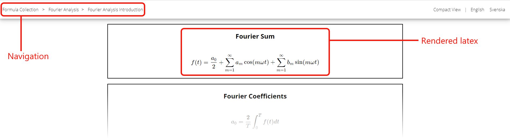

# About
This project automatically generates a formula collection website from a latex document at overleaf.com (or other source with a slightly modified build script). After configuring the project (see Building), simply run build.sh to automatically update the website from the overleaf source. As an example, the site https://formulas.openopticsmodule.com is generated by the latex document found at https://www.overleaf.com/read/yjjyhwbzqyrh.

The project was made for the physics department at Lund University to easily be able to modify and update an online collection of formulas. A formula page has the following style:



# Latex Document Notation
- The document title becomes the main header of the website
- The sections, subsections turn into navigation pages, one exception being the "Metadata" section at the top of the document, (see Metadata).
- Once one has navigated to a subsection, the page is filled by blocks/sections based on subsubsections. Equations and text are supported.
- Translations are handled anywhere inside the document by adding double square brackets, and separating the translations inside by a slash: [[\<language 1\>/\<language 2\>]] - where languages are defined in the metadata (see Metadata).
- An internal or external link can be added to each subsubsection block by adding the line "INTERACTIVE[\url{\<your url here\>}]" to the beginning of the subsubsection. This can either be a external url, or the name of a svelte page placed under src/routes/[lang]/interactive

Example of latex source:

```latex
    \documentclass{article}

    \title{[[Formula Collection/Formelsamling]]}

    \begin{document}
        \section{Metadata}
            \subsection{Language Settings}
                \subsubsection*{Languages}
                    \begin{itemize}
                    \item en - English
                    \item sv - Svenska
                    \end{itemize}

                \subsubsection*{Default}
                    en
        \section{[[Mathematics/Matematik]]}
            \subsection{[[Linear Algebra/Linjär algebra]]}
                \subsubsection*{Projection}
                    INTERACTIVE[\url{https://en.wikipedia.org/wiki/Projection}]
                    [[Orthogonal projection onto a line/Ortogonal projektion på linje]]

                    \begin{equation}
                        w_{[[projection/projektion]]} = \frac{u \dot v}{\|v\|^2}v
                    \end{equation}
                \subsubsection*{Gauss Elimination}
                    ...
            \subsection{[[Trigonometr[[y/i]]}
                ...
        \section{Physics}
            ...
        \section{Biology}
            ...
        \section{Chemistry}
            ...
    \end{document}
```
# Metadata

- The metadata section needs to contain:
    - Language settings: Available languages, identifiers (for example ISO 639-1 language codes), and default language

For an example of how the metadata section can be structured, see section on Latex document notation

# Building
- requires node.js and python
- Copy build_config_template.txt and rename to build_config.txt and fill in fields
- Setup ssh keys to the remote webserver (for example by using ssh-copy-id)
- Run build.sh

# Fields in build_config.txt
- overleaf_source - overleaf source document, in the form ht<span>tp</span>s://w<span>ww.</span>overleaf.com/project/YOUR-PROJECT-ID
- overleaf_session_cookie - overleaf session cookie, in chrome this is retrieved by pressing F12 after logging in to your overleaf account, navigating to Application -> Cookies and copying the value of "overleaf_session2"
- ssh_dest - in the form username<span>@</span>destination.com
- download/compile/upload are boolean variables, to enable/disable parts of the build process during testing

# Build Process

- The website is built in two steps:
    - After the source has been downloaded, a python script located under generate_source/latex_to_json.py converts the latex source document to json, placing the newly generated page source in the src/json folder, this script also creates tex files of the subjects for each language under generate_source/generated, and generates pdf files in src/static/latex.
    - The svelte components (placed under src/components) and pages (placed under src/routes) use this source to to generate a static website during the build step (runs npm run build). The new website folder is then uploaded to the webserver over ssh
